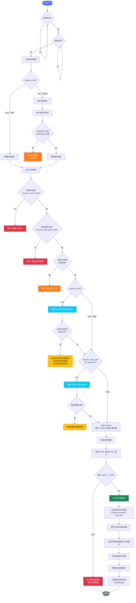

# AGV任务下发与查询系统

## 系统概述

AGV任务下发与查询系统是一个基于Web的自动化导引车任务管理平台，用于实现跨环境任务的查询、下发与优先级管理。系统提供了直观的用户界面，支持多种任务模板的快速下发，并具备智能的任务状态检查、实时查询、优先级调整以及**点位容量管控**功能。

## 主要功能

### 1. 任务下发
- 支持多种区域和任务模板选择
- 智能表单字段显示（根据任务类型动态显示货架号和任务路径字段）
- 一键下发任务到AGV系统
- 任务下发后自动执行任务查询

### 2. 任务状态检查
- **智能防重复下发**：在下发携带货架号的任务前，自动检查该货架是否存在以下状态的任务：
  - 4 - 正在发送
  - 6 - 执行中  
  - 9 - 已下发
  - -1 - 容量管控
- 如果存在相关任务，系统会弹窗提示用户，防止任务冲突

### 3. 任务查询功能
- **双模式查询**：
  - 按货架号查询：查询指定货架的相关任务
  - 按OrderId查询：通过订单ID精确查询任务
- **智能状态排序**：按货架查询时优先显示执行中任务，其次已下发，最后正在发送
- **子任务详情展示**：显示完整的子任务序列和执行状态

### 4. 优先级管理
- **优先执行功能**：为第一个子任务提供优先级调整
- **智能状态判断**：仅允许对"已下发"状态的任务调整优先级
- **防误操作保护**：已开始执行的任务无法调整优先级

### 5. 点位容量管控（新增）
- **实时占用显示**：在任务路径下拉菜单中，每个点位后显示当前占用计数，例如 `四线 1 (66000358) [1/2]`
- **自动禁用**：当点位已达容量上限时，该选项自动变灰禁用，无法选择
- **下发前二次校验**：点击下发按钮时再次查询实时占用，若已满则弹窗提示阻止下发
- **可配置容量**：在任务模板中通过 `capacity` 字段设置最大并发数（默认0表示不限制）

### 6. 历史记录保护
- 5分钟内重复下发同一货架任务保护机制
- 自动记录货架任务下发时间

### 7. 用户界面特性
- **响应式设计**：支持桌面、平板、手机等不同设备访问
- **双栏布局**：左侧任务下发，右侧任务查询，操作流程清晰
- **明暗主题切换**：支持亮色和暗色主题，适应不同使用环境
- **实时调试信息**：可查看发送报文和响应信息
- **友好的交互反馈**：模态框提示、状态标签、防重复点击机制

## 系统配置

系统支持多个区域的配置，每个区域包含不同的任务模板。配置对象中的每个任务模板可添加以下字段：

| 字段名 | 类型 | 必填 | 描述 |
|--------|------|------|------|
| `base_url` | string | 是 | 任务下发接口地址 |
| `code` | string | 是 | 任务模板编码 |
| `requires_shelf` | boolean | 是 | 是否需要货架号 |
| `requires_task_path` | boolean | 是 | 是否需要选择任务路径 |
| `task_path_options` | array | 否 | 任务路径选项列表（字符串或对象`{value, label}`） |
| `capacity` | number | 否 | 点位容量限制，0表示不限制，>0表示最大并发数 |
| `roller_task` | boolean | 否 | 标记为辊筒任务（非跨环境，无货架），需配合全局开关 `_features.enable_roller_task` |
| `roller_point` | string | 否 | 辊筒任务固定下发点位 code（如 `66000553`），下发时写入 `taskPath` |
| `roller_point_label` | string | 否 | 下发点位中文说明（仅显示用） |

### 配置示例
```json
"上架搬运_行业货架区2去点胶回_447": {
    "base_url": "http://10.68.2.32:7000/ics/taskOrder/addTask",
    "code": "SJBY_32A3DJ2F_to_31A3QD4B3F_447",
    "requires_shelf": true,
    "requires_task_path": true,
    "task_path_options": [
        {"value": "66000358", "label": "四线 1"},
        {"value": "66000359", "label": "四线 2"},
        {"value": "66000380", "label": "五线"}
    ],
    "capacity": 2   // 表示每个点位最多同时执行2个任务
}
```

## 使用说明

### 任务下发流程



1. **选择区域**：从下拉菜单中选择任务执行区域
2. **选择任务模板**：根据业务需求选择具体的任务类型
3. **填写任务参数**：
   - 如需货架号：输入对应的货架编号
   - 如需任务路径：从下拉列表中选择点位，列表中将显示实时占用计数（如 `[1/2]`）
4. **下发任务**：点击"下发任务"按钮，系统将自动检查货架状态和点位容量，无误后执行下发
5. **自动查询**：任务下发成功后自动跳转到查询界面显示任务状态

### 任务查询流程

1. **选择查询模式**：
   - 按货架查询：输入货架号查询相关任务
   - 按OrderId查询：输入订单ID精确查询
2. **执行查询**：点击"查询任务"按钮获取任务信息
3. **查看详情**：系统显示主任务信息和所有子任务详情
4. **管理优先级**：对第一个"已下发"状态的子任务点击"优先执行"

### 任务状态检查规则

- **需要检查的情况**：当任务配置中`requires_shelf`为`true`时
- **检查内容**：查询该货架在状态4、6、9、-1下是否存在任务
- **检查结果处理**：
  - 如果存在任务：弹窗提示，阻止下发，并自动在右侧查询界面显示该货架的任务信息
  - 如果不存在任务：正常下发
  - 如果查询失败：继续下发（容错处理）

### 辊筒任务（新增 v1.7.0）

辊筒任务是一种非跨环境、不带货架的 AGV 搬运任务。辊筒工装直接对接线体，不需要用户填写货架号。

#### 配置方式

在任务模板中新增以下字段：

```json
"辊筒搬运任务": {
    "base_url": "http://10.68.2.32:7000/ics/taskOrder/addTask",
    "code": "unLoading1",
    "requires_shelf": false,
    "capacity": 1,
    "roller_task": true,
    "roller_point": "66000553",
    "roller_point_label": "线头A-上料位"
}
```

同时需要在 `dispatch_config.json` 的根部添加全局开关：

```json
"_features": {
    "enable_roller_task": true
}
```

#### 功能特性

| 特性 | 说明 |
|------|------|
| **下拉框居分组** | 辊筒任务独立显示在 `⏏️ 辊筒任务` 分组，与空车/非空车分开 |
| **固定点位** | 下发点位在配置中写死，用户无需选择，表单只读显示 |
| **容量管控** | 复用 `capacity` 字段，已下发未完成数 >= capacity 时禁止下发 |
| **已下发缓存** | 下发后 orderId 存入 `localStorage`，自动查询状态（15秒轮询） |
| **自动释放** | 查询到状态 8（已完成）自动从缓存清除，释放容量 |
| **OrderId 前缀** | 辊筒任务订单前缀为 `RLLR_`，后端按前缀自动路由到非跨环境 API |
| **查询路由** | `RLLR_` → `POST {ip}:7000/ics/out/task/getTaskOrderStatus`；`CEM_` → 先查 `{ip}:8315/crossTask/query`，未找到则回退到辊筒 API |

#### 交互流程

```
选中辊筒任务 → 隐藏货架/路径输入 → 显示点位提示
              → 加载 localStorage 已下发订单
              → 逐个查询状态（自动清理已完成）
              → 15秒轮询更新
点击下发 → 检查活跃订单是否 >= capacity
         → 满容弹窗阻止，否则正常下发
         → 成功后将 orderId 写入缓存
```

#### API 变更

- 新增 `POST {ip}:7000/ics/out/task/getTaskOrderStatus` 查询接口（非跨环境）
- `/addtask/query` 后端路由按 `orderId` 前缀自动分流

### 点位容量管控规则

## 技术架构

### 前端技术
- HTML5 + CSS3 + 原生JavaScript
- 响应式网格布局设计
- CSS变量主题系统
- 本地存储主题偏好
- **组件化设计**：使用Flask模板系统实现组件化，提高代码复用性和可维护性
  - `addtask.html` 拆分为：页头、表单、查询三个组件
  - `config_editor.html` 拆分为：页头、可视化编辑器、源文件编辑器、备份管理四个组件
  - CSS样式提取到单独文件：`static/css/config_editor.css`

### 接口对接

#### 任务下发接口
- **地址**：`http://10.68.2.32:7000/ics/taskOrder/addTask`（可变）
- **方法**：POST
- **内容**：JSON格式任务数据

#### 任务查询接口
- **大模板查询**：`http://10.68.2.32:8315/crossTask/query`
- **子任务查询**：`http://10.68.2.32:8315/crossTask/detail`
- **优先级调整**：`http://{serviceUrl}/ics/out/updateTaskPriority`

### 数据格式

#### 任务下发数据
```json
{
  "modelProcessCode": "任务代码",
  "priority": 6,
  "orderId": "订单ID",
  "fromSystem": "pad-html",
  "taskOrderDetail": {
    "taskPath": "任务路径",
    "shelfNumber": "货架号"
  }
}
```

#### 任务状态定义
- **8**：已完成
- **6**：执行中
- **4**：正在发送
- **9**：已下发
- **-1**：容量管控
- **0**：待处理

## 部署要求

### 环境要求
- 现代浏览器（Chrome 60+、Firefox 55+、Edge 79+等）
- 支持ES6+的JavaScript环境
- 网络访问权限（能够访问后端API服务）

### 部署步骤
1. 将HTML文件部署到Web服务器
2. 确保跨域访问权限配置正确
3. 验证后端API服务可用性
4. 测试各功能模块正常运行

## 维护信息

### 配置更新
系统配置内嵌在HTML文件中，如需更新区域或任务模板，需要修改`config`对象中的对应配置。

### 故障排查
- 查看浏览器控制台错误信息
- 使用调试模式查看发送报文和响应数据
- 检查网络连接和API服务状态
- 验证接口地址和参数格式

### 监控指标
- 任务下发成功率
- 查询响应时间
- 用户操作频率
- 系统错误率

## 版本信息

- **当前版本**：v1.7.0
- **更新日期**：2026年6月12日
- **新增功能**：辊筒任务支持、已下发缓存管理、容量管控
- **技术支持**：运营AGV组

## 更新日志

### 2026-06-12 v1.7.0
- **新增**：辊筒任务模块
  - 任务级开关 `roller_task` + 全局开关 `_features.enable_roller_task`
  - 固定下发点位 `roller_point`，用户无需选择
  - 下拉框独立 `⏏️ 辊筒任务` 分组
- **新增**：辊筒任务已下发缓存管理
  - `localStorage` 缓存已下发 orderId，15秒轮询状态
  - 状态 8（已完成）自动清除释放容量
  - 下发前检查活跃数达到 `capacity` 时弹窗阻止
- **新增**：查询路由自动分流
  - `RLLR_` 前缀 → 非跨环境 API `:7000/ics/out/task/getTaskOrderStatus`
  - `CEM_` 前缀 → 先查跨环境 API，未找到则回退到辊筒 API
- **新增**：配置保存时自动补全 `_features` 字段（后端 `save_config` 自动修复）
- **增强**：`save_config` 自动确保 `_features.enable_roller_task` 存在
- **增强**：`ensureConfigCompatibility` 自动补全辊筒字段和 `_features`
- **优化**：区域列表支持双击重命名（独立+内联编辑器）
- **优化**：`/config-editor` 统一跳转到 `/addtask/config-view`
- **优化**：配置保存后自动同步到 dispatch 页下拉分组，无需手动刷新

### 2026-04-22 v1.6.0
- **重构**：组件化设计重构
  - `addtask.html` 拆分为多个组件：页头、表单、查询
  - `config_editor.html` 拆分为多个组件：页头、可视化编辑器、源文件编辑器、备份管理
  - CSS样式提取到单独文件：`static/css/config_editor.css`
- **优化**：提高代码复用性和可维护性
- **修复**：解决 `config_editor.html` 文件损坏问题，使用git恢复功能修复

### 2026-03-12 v1.5.0
- **新增**：点位容量管控功能
  - 任务模板可配置`capacity`字段限制点位并发数
  - 下拉选项实时显示当前占用计数，如 `[1/2]`
  - 点位满额时自动禁用并无法选择
  - 下发前二次校验，防止并发冲突
- **优化**：任务路径下拉选项支持动态刷新计数
- **文档**：更新帮助文档，添加容量管控配置说明

### 2026-01-09 v1.4.2
- **新增**：货架任务状态检查增加容量管控状态（-1）检测
- **增强**：检查到货架存在任务时自动在右侧查询界面显示任务信息

### 2026-01-07 v1.4.1
- **修复**：上架任务货架任务状态检查逻辑

## 注意事项

1. **数据准确性**：请确保货架号输入准确，避免任务下发错误
2. **操作规范**：系统会进行任务状态检查，请勿强行绕过检查机制
3. **权限控制**：优先执行功能仅对第一个子任务有效，防止误操作
4. **系统监控**：如遇系统异常，请及时联系技术支持人员
5. **配置维护**：定期检查系统配置，确保与现场业务流程匹配
6. **网络要求**：确保网络稳定，避免因网络问题导致操作失败
7. **容量配置**：合理设置`capacity`值，避免过于严格或宽松的限制影响生产效率

---

*本系统专为AGV任务管理设计，持续优化中。如有功能需求变更请联系开发团队。*

## 附录

### 任务查询接口
//:表示支持使用，但一般不使用字段

#### fywds 跨环境大任务信息
请求地址：http://10.68.2.32:8315/crossTask/query
可按照货架查询，或 orderId 查询

使用 orderId 查询示例：
```json
{
    //"endTime": "2025-11-03 15:59:59",
    //"startTime": "2025-10-29 15:00:00",
    "taskStatus": "6",//8已完成6执行中4正在发送9已下发
    //"shelfNum": "DJ0019",
    "orderId":"DWCS03887189",
    "pageSize": 20,
    "pageNo": 1
}
```
返回
```json
{
    "code": 1000,
    "data": {
        "endRow": 1,
        "hasNextPage": false,
        "hasPreviousPage": false,
        "isFirstPage": true,
        "isLastPage": true,
        "list": [
            {
                "createTime": 1773276891000,
                "deviceCode": "6M05951PA400013",
                "deviceNum": "0096",
                "enable": 1,
                "fromSystem": "DWCS",
                "id": 1850590,
                "ignore": 0,
                "isCreateTask": 0,
                "modelProcessCode": "moveShelfToWLCK1ToDJSIB",
                "modelProcessName": "货架搬运WLCK1到DJSIB",
                "orderId": "DWCS03887189",
                "remark": "{\"areaId\":1,\"fromSystem\":\"DWCS\",\"modelProcessCode\":\"moveShelfToWLCK1ToDJSIB\",\"orderId\":\"DWCS03887189\",\"priority\":4,\"taskOrderDetail\":[{\"shelfNumber\":\"AG01-139\",\"taskPath\":\"55300349,55300349\"}],\"taskTypeId\":0}",
                "shelfNum": "AG01-139",
                "taskError": "已下发",
                "taskPath": "55300349,55300349",
                "taskStatus": 6,
                "updateTime": 1773276995000
            }
        ],
        "navigateFirstPage": 1,
        "navigateLastPage": 1,
        "navigatePages": 8,
        "navigatepageNums": [
            1
        ],
        "nextPage": 0,
        "pageNum": 1,
        "pageSize": 20,
        "pages": 1,
        "prePage": 0,
        "size": 1,
        "startRow": 1,
        "total": 1
    },
    "desc": "success"
}
```
用 shelfNum 查询示例：
```json
{
    //"endTime": "2025-11-03 15:59:59",
    //"startTime": "2025-10-29 15:00:00",
    "taskStatus": "6",//8已完成6执行中4正在发送9已下发
    "shelfNum": "DJ0019",
    "pageSize": 20,
    "pageNo": 1
}
```
返回
```json
{
    "code": 1000,
    "data": {
        "endRow": 1,
        "hasNextPage": false,
        "hasPreviousPage": false,
        "isFirstPage": true,
        "isLastPage": true,
        "list": [
            {
                "createTime": 1762928694000,
                "deviceCode": "CD04214DAK00001",
                "deviceNum": "DJ57",
                "enable": 1,
                "fromSystem": "pad-html",
                "id": 1587815,
                "ignore": 0,
                "isCreateTask": 0,
                "modelProcessCode": "HJBY_go_27HY2DJ2F_to_31A3QD4B3F",
                "modelProcessName": "送满A3货架区二2F去A3前端四部3F",
                "orderId": "pad_html2025-11-12 06:22:41",
                "remark": "{\"fromSystem\":\"pad-html\",\"modelProcessCode\":\"HJBY_go_27HY2DJ2F_to_31A3QD4B3F\",\"orderId\":\"pad_html2025-11-12 06:22:41\",\"priority\":6,\"taskOrderDetail\":[{\"shelfNumber\":\"DJ0019\",\"taskPath\":\"\"}],\"taskTypeId\":0}",
                "shelfNum": "DJ0019",
                "taskError": "已下发",
                "taskPath": "",
                "taskStatus": 6,
                "updateTime": 1762929605000
            }
        ],
        "navigateFirstPage": 1,
        "navigateLastPage": 1,
        "navigatePages": 8,
        "navigatepageNums": [
            1
        ],
        "nextPage": 0,
        "pageNum": 1,
        "pageSize": 20,
        "pages": 1,
        "prePage": 0,
        "size": 1,
        "startRow": 1,
        "total": 1
    },
    "desc": "success"
}
```
用 modelProcessCode 查询示例：
```json
{
    //"endTime": "2025-11-03 15:59:59",
    //"startTime": "2025-10-29 15:00:00",
    "taskStatus": "6",//8已完成6执行中4正在发送9已下发
    //"shelfNum": "DJ0019",
    //"orderId":"DWCS03887189",
    "modelProcessCode":"SJBY_32A3DJ2F_to_31A3QD4B3F_447",
    "pageSize": 20,
    "pageNo": 1
}
```
返回
```json
{
    "code": 1000,
    "data": {
        "endRow": 1,
        "hasNextPage": false,
        "hasPreviousPage": false,
        "isFirstPage": true,
        "isLastPage": true,
        "list": [
            {
                "createTime": 1773275196000,
                "deviceCode": "EM00123DAK00003",
                "deviceNum": "DJC2",
                "enable": 1,
                "fromSystem": "pad-html",
                "id": 1850445,
                "ignore": 0,
                "isCreateTask": 0,
                "modelProcessCode": "SJBY_32A3DJ2F_to_31A3QD4B3F_447",
                "modelProcessName": "上架搬运_A3点胶2F去A3前端四部3F_447",
                "orderId": "pad_html1970-01-15 06:23:39",
                "remark": "{\"fromSystem\":\"pad-html\",\"modelProcessCode\":\"SJBY_32A3DJ2F_to_31A3QD4B3F_447\",\"orderId\":\"pad_html1970-01-15 06:23:39\",\"priority\":6,\"taskOrderDetail\":[{\"shelfNumber\":\"DJ0052\",\"taskPath\":\"66000380\"}],\"taskTypeId\":0}",
                "shelfNum": "DJ0052",
                "taskError": "已下发",
                "taskPath": "66000380",
                "taskStatus": 6,
                "updateTime": 1773275567000
            }
        ],
        "navigateFirstPage": 1,
        "navigateLastPage": 1,
        "navigatePages": 8,
        "navigatepageNums": [
            1
        ],
        "nextPage": 0,
        "pageNum": 1,
        "pageSize": 20,
        "pages": 1,
        "prePage": 0,
        "size": 1,
        "startRow": 1,
        "total": 1
    },
    "desc": "success"
}
```

#### fywds 跨环境子任务信息
输入大任务模板中查询到的 id 字段，查询对应子任务的信息。
请求地址：http://10.68.2.32:8315/crossTask/detail
```json
{"id":1587815}
```

返回：
```json
{
    "code": 1000,
    "data": [
        {
            "changeStatus": 3,
            "createTime": 1762928695000,
            "deviceCode": "CD04214DAK00001",
            "deviceNum": "DJ57",
            "endTime": 1762876800000,
            "errorDesc": "任务完成",
            "id": 5335564,
            "orderId": "pad_html2025-11-12 06:22:41",
            "serviceUrl": "http://10.68.2.32:7000",
            "shelfNumber": "DJ0019",
            "status": 8,
            "subOrderId": "pad_html2025-11-12 06:22:41_1_9859",
            "taskPath": "66000288",
            "taskSeq": 1,
            "templateCode": "moveKCDJ-1",
            "templateName": "moveKCDJ-1",
            "updateTime": 1762928759000
        },
        {
            "changeStatus": 3,
            "createTime": 1762928695000,
            "deviceCode": "CD04214DAK00001",
            "deviceNum": "DJ57",
            "endTime": 1762876800000,
            "errorDesc": "任务完成",
            "id": 5335565,
            "orderId": "pad_html2025-11-12 06:22:41",
            "serviceUrl": "http://10.68.2.32:7000",
            "shelfNumber": "DJ0019",
            "status": 8,
            "subOrderId": "pad_html2025-11-12 06:22:41_2_9085",
            "taskPath": "60000026",
            "taskSeq": 2,
            "templateCode": "moveKC-3",
            "templateName": "moveKC-3",
            "updateTime": 1762928835000
        },
        {
            "changeStatus": 3,
            "createTime": 1762928695000,
            "deviceCode": "CD04214DAK00001",
            "deviceNum": "DJ57",
            "endTime": 1762876800000,
            "errorDesc": "任务完成",
            "id": 5335566,
            "orderId": "pad_html2025-11-12 06:22:41",
            "serviceUrl": "http://10.68.2.27:7000",
            "shelfNumber": "DJ0019",
            "status": 8,
            "subOrderId": "pad_html2025-11-12 06:22:41_3_4838",
            "taskPath": "60000017",
            "taskSeq": 3,
            "templateCode": "JuSheng_HJQ2-1",
            "templateName": "JuSheng_HJQ2-1",
            "updateTime": 1762928944000
        },
        {
            "changeStatus": 3,
            "createTime": 1762928695000,
            "deviceCode": "CD04214DAK00001",
            "deviceNum": "DJ57",
            "endTime": 1762876800000,
            "errorDesc": "任务完成",
            "id": 5335567,
            "orderId": "pad_html2025-11-12 06:22:41",
            "serviceUrl": "http://10.68.2.32:7000",
            "shelfNumber": "DJ0019",
            "status": 8,
            "subOrderId": "pad_html2025-11-12 06:22:41_4_6277",
            "taskPath": "99990226",
            "taskSeq": 4,
            "templateCode": "FuZai_32-3",
            "templateName": "FuZai_32-3",
            "updateTime": 1762929183000
        },
        {
            "createTime": 1762928695000,
            "deviceCode": "CD04214DAK00001",
            "deviceNum": "DJ57",
            "endTime": 1762876800000,
            "errorDesc": "任务完成",
            "id": 5335568,
            "orderId": "pad_html2025-11-12 06:22:41",
            "serviceUrl": "http://10.68.2.31:7000",
            "shelfNumber": "DJ0019",
            "status": 8,
            "subOrderId": "pad_html2025-11-12 06:22:41_5_9493",
            "taskPath": "99990226",
            "taskSeq": 5,
            "templateCode": "FangXia_DJQ4-23",
            "templateName": "FangXia_DJQ4-23",
            "updateTime": 1762929603000
        },
        {
            "createTime": 1762928695000,
            "deviceCode": "CD04214DAK00001",
            "deviceNum": "DJ57",
            "errorDesc": "已下发",
            "id": 5335569,
            "orderId": "pad_html2025-11-12 06:22:41",
            "serviceUrl": "http://10.68.2.31:7000",
            "shelfNumber": "DJ0019",
            "status": 6,
            "subOrderId": "pad_html2025-11-12 06:22:41_6_8829",
            "taskPath": "99990249",
            "taskSeq": 6,
            "templateCode": "moveKCDJ-23",
            "templateName": "空车跨环境点胶-23",
            "updateTime": 1762929605000
        },
        {
            "createTime": 1762928695000,
            "id": 5335570,
            "orderId": "pad_html2025-11-12 06:22:41",
            "serviceUrl": "http://10.68.2.32:7000",
            "status": 0,
            "subOrderId": "pad_html2025-11-12 06:22:41_7_1134",
            "taskPath": "66000281",
            "taskSeq": 7,
            "templateCode": "moveKC-3",
            "templateName": "空车跨环境-3",
            "updateTime": 1762928695000
        },
        {
            "createTime": 1762928695000,
            "id": 5335571,
            "orderId": "pad_html2025-11-12 06:22:41",
            "serviceUrl": "http://10.68.2.32:7000",
            "status": 0,
            "subOrderId": "pad_html2025-11-12 06:22:41_8_6622",
            "taskPath": "66000281",
            "taskSeq": 8,
            "templateCode": "no_stop-1",
            "templateName": "no_stop-1",
            "updateTime": 1762928695000
        }
    ],
    "desc": "success"
}
```
