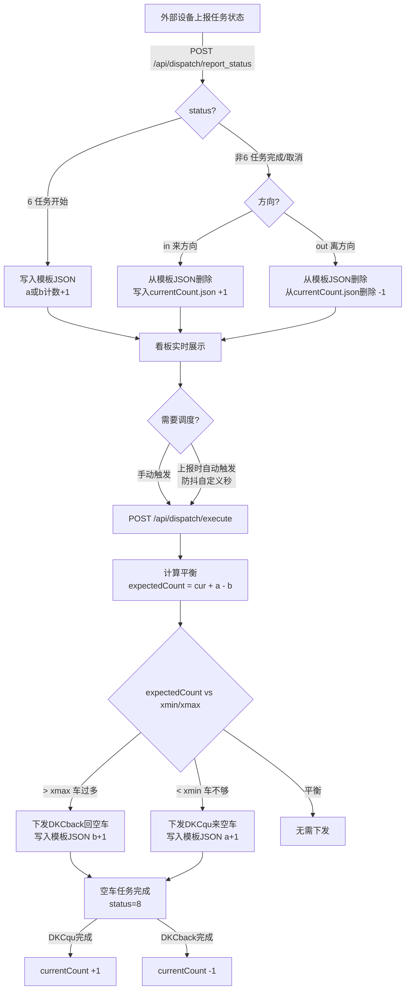
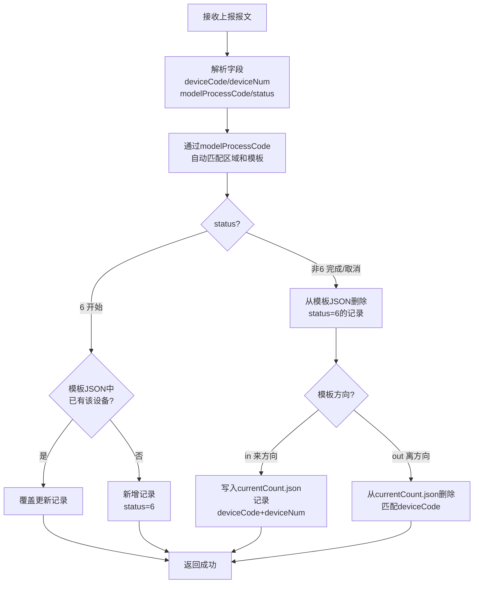
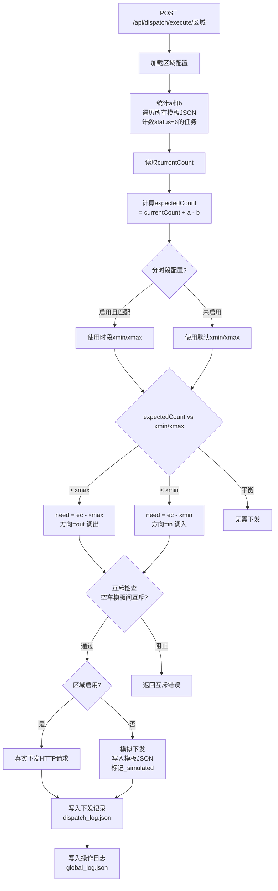
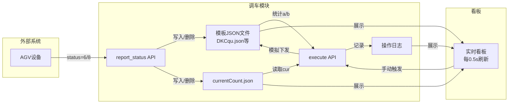
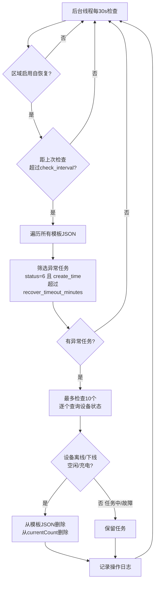

# 空车调车模块

## 功能概述

空车调车模块用于监控各区域设备平衡状态，自动/手动下发调车任务。基于本地 JSON 文件实现数据持久化，零外部依赖。

## 页面说明

### 1. 主看板 (`/dispatch`)

展示各区域设备平衡状态：

| 指标 | 说明 |
|------|------|
| 当前设备 | `currentCount.json` 中的设备数 |
| 需调度 | 需要调出/调入的设备数 |
| 方向 | 平衡/调出/调入 |
| 保留范围 | xmin ~ xmax 保留范围 |

每个区域卡片显示：
- 来区域模板及其任务数
- 离开模板及其任务数
- 操作按钮：详情、自动调车、**JSON 文件**、配置
- 启用/禁用开关（实时切换）

#### JSON 文件查看/编辑

点击区域卡片的 `[📄 JSON文件]` 按钮，在该卡片下方展开面板：
- 列出该区域所有关联的 JSON 文件（模板文件 + `currentCount.json`）
- 不存在的文件显示「未创建」，点击「创建」可新建
- **查看模式**：只读展示文件内容
- **编辑模式**：textarea 编辑 + JSON 格式校验 + 保存后自动刷新看板

> **注意**：看板每 10 秒自动刷新，采用增量更新模式（只更新数字和状态，不重新渲染 DOM），展开的 JSON 面板不会被关闭。

### 2. 配置管理 (`/dispatch/config`)

三标签页编辑模式：

#### 可视化编辑
- 区域列表：增删改区域
- 每个区域可编辑：区域标识、areaId、服务器地址、xmin/xmax、单次最大调车数
- 模板列表：增删改模板（代码、文件名、方向）

#### 源文件编辑
- 直接编辑 JSON 格式的配置内容
- 点击"应用到可视化编辑器"同步

#### 备份恢复
- Git 图形版本历史展示
- 创建备份（可带描述）
- 查看/恢复/删除备份

### 3. 区域详情 (`/dispatch/area/<id>`)

查看指定区域的详细状态。

## 数据文件

所有数据存储在 `data/dispatch/` 目录下（已加入 .gitignore）：

```
data/dispatch/
├── cache_index.json              # 主配置文件（区域、服务器、模板映射）
├── backups/                      # 备份文件目录
│   ├── dispatch_config_20260428_120000.json
│   └── ...
├── region_1_currentCount.json    # 区域1当前设备列表
├── region_1_DKCqu.json           # 区域1调空车来模板数据
└── ...
```

### cache_index.json 格式

```json
{
  "auto_dispatch_debounce": 5,
  "区域1": {
    "areaId": "1",
    "enabled": true,
    "max_dispatch_once": 3,
    "server": "10.68.2.31:7000",
    "xmin": 2,
    "xmax": 4,
    "templates": [
      {"code": "K1", "display_name": "调空车来", "file": "K1.json", "task_type": "empty_in",  "shared": false},
      {"code": "K2", "display_name": "回空车",   "file": "K2.json", "task_type": "empty_out", "shared": false},
      {"code": "F1", "display_name": "负载来",   "file": "F1.json", "task_type": "load_in",   "shared": false},
      {"code": "F2", "display_name": "负载回",   "file": "F2.json", "task_type": "load_out",  "shared": false}
    ],
    "empty_dispatch": {
      "url": "http://10.68.2.31:7000/ics/taskOrder/addTask",
      "template": "DKCqu"
    },
    "time_slots": {
      "enabled": false,
      "slots": [
        {"start": "08:00", "end": "20:00", "xmin": 3, "xmax": 6},
        {"start": "20:00", "end": "08:00", "xmin": 1, "xmax": 2}
      ]
    },
    "self_heal": {
      "enabled": false,
      "check_interval": 300,
      "recover_timeout_minutes": 30,
      "device_query_api": "/ics/out/device/list/deviceInfo"
    }
  }
}
```

### 模板字段说明

| 字段 | 类型 | 必填 | 说明 |
|------|------|:---:|------|
| `code` | string | ✅ | 模板代码，计算用唯一标识（如 `K1`），上报时 `modelProcessCode` 匹配此字段 |
| `display_name` | string | ❌ | 看板显示名称，可自定义中文名（如 `调空车来`），为空时回退到 `code` |
| `file` | string | ✅ | 对应的 JSON 文件名（如 `K1.json`） |
| `task_type` | string | ✅ | 模板类型：`empty_in` / `empty_out` / `load_in` / `load_out` |
| `shared` | bool | ❌ | 是否跨区域共享模板，共享模板存储在 `_shared/` 目录 |

### 区域配置字段说明

| 字段 | 类型 | 默认值 | 说明 |
|------|------|--------|------|
| `areaId` | string | `"0"` | 区域 ID |
| `enabled` | bool | `false` | 区域启用开关，关闭时走模拟下发 |
| `server` | string | `""` | ICS 服务器地址（`ip:port`） |
| `xmin` | int | `2` | 保留设备数下限 |
| `xmax` | int | `4` | 保留设备数上限 |
| `max_dispatch_once` | int | `3` | 单次最大调车数（容量管控） |
| `auto_dispatch_debounce` | int | `5` | 自动调度防抖秒数（顶层配置） |
| `empty_dispatch.url` | string | — | 空车下发 URL，支持完整 `http://` 地址 |
| `empty_dispatch.template` | string | — | 空车下发模板代码，为空时使用空车模板的 `code` |
| `time_slots.enabled` | bool | `false` | 分时段配置开关 |
| `time_slots.slots` | array | `[]` | 时段列表，支持跨天（如 `20:00~08:00`），`xmin=-1,xmax=-1` 表示禁用 |
| `self_heal.enabled` | bool | `false` | 自恢复开关 |
| `self_heal.check_interval` | int | `300` | 自恢复检查间隔（秒） |
| `self_heal.recover_timeout_minutes` | int | `30` | 异常任务超时阈值（分钟） |
| `self_heal.device_query_api` | string | — | 设备状态查询 API，支持相对路径或完整 `http://` URL |

### task_type 四种类型

| task_type | 含义 | 参与 a/b | 自动下发 | 互斥检查 | currentCount |
|-----------|------|:---:|:---:|:---:|:---:|
| `empty_in` | 🚛 自动调空车来 | ✅ a | ✅ | ✅ | 完成时 +1 |
| `empty_out` | 🚛 自动调空车回 | ✅ b | ✅ | ✅ | 完成时 -1 |
| `load_in` | 📦 其他来任务（货架+车） | ✅ a | ❌ | ❌ | 完成时 +1 |
| `load_out` | 📦 其他回任务（货架+车） | ✅ b | ❌ | ❌ | 完成时 -1 |

- `task_type` — 模板类型（替代旧 `direction` 字段，向后兼容自动推断）
- `shared: true` — 跨区域共享模板，文件存储在 `_shared/` 目录
- `enabled` — 区域启用/禁用开关
- `max_dispatch_once` — 单次最大调车数（容量管控）
- `auto_dispatch_debounce` — 自动调度防抖秒数（默认5）

### currentCount.json 格式

```json
[
  {"deviceCode": "BL11637BAK00010", "deviceNum": "C185", "create_time": "2026-04-28T12:00:00"},
  {"deviceCode": "BL11637BAK00011", "deviceNum": "C186", "create_time": "2026-04-28T12:05:00"}
]
```

每条记录包含设备序列号(`deviceCode`)和设备编号(`deviceNum`)，可有多条。

## API 接口

### 权限说明

调车模块已接入系统账号体系，权限分为三级：

| 权限 | 说明 |
|------|------|
| 🔓 无需登录 | 外部设备上报接口，无需认证 |
| 🔑 登录 | 登录用户可访问（普通用户或管理员） |
| ⚙️ 管理员 | 需在首页启用管理员提权 |

### 接口列表

| 方法 | 路径 | 权限 | 说明 |
|------|------|------|------|
| GET | `/dispatch` | 🔑 登录 | 主看板页面 |
| GET | `/dispatch/config` | ⚙️ 管理员 | 配置编辑页面 |
| GET | `/dispatch/area/<id>` | 🔑 登录 | 区域详情页面 |
| GET | `/api/dispatch/status` | 🔑 登录 | 获取所有区域状态（含平衡计算） |
| GET | `/api/dispatch/config` | 🔑 登录 | 获取配置 |
| POST | `/api/dispatch/config` | ⚙️ 管理员 | 保存配置 |
| GET | `/api/dispatch/config/backups` | 🔑 登录 | 列出备份 |
| POST | `/api/dispatch/config/backup` | ⚙️ 管理员 | 创建备份 |
| GET | `/api/dispatch/config/backup/<name>` | 🔑 登录 | 查看备份内容 |
| POST | `/api/dispatch/config/backup/<name>/restore` | ⚙️ 管理员 | 恢复备份 |
| DELETE | `/api/dispatch/config/backup/<name>` | ⚙️ 管理员 | 删除备份 |
| GET | `/api/dispatch/region_files/<region_key>` | 🔑 登录 | 获取区域关联的文件列表 |
| GET | `/api/dispatch/region_file/<region_key>/<filename>` | 🔑 登录 | 获取文件内容 |
| POST | `/api/dispatch/region_file/<region_key>/<filename>` | ⚙️ 管理员 | 保存文件内容 |
| POST | `/api/dispatch/execute/<region_key>` | 🔑 登录 | 执行计算并下发调车 |
| POST | `/api/dispatch/clean_simulated/<region_key>` | 🔑 登录 | 清理模拟数据 |
| GET | `/api/dispatch/dispatch_log/<region_key>` | 🔑 登录 | 获取下发记录 |
| POST | `/api/dispatch/dispatch_log/<region_key>` | ⚙️ 管理员 | 写入下发记录 |
| **POST** | **`/api/dispatch/report_status`** | **🔓 无需登录** | **任务状态上报接口（外部设备）** |

### 状态上报接口

**路径**: `POST /api/dispatch/report_status`

**权限**: 🔓 无需登录（外部设备上报）

**响应**: 始终返回 `{"code": 1000, "desc": "success"}`，即使匹配失败也返回 1000 避免 ICS 重试。

#### 报文格式1：内部格式（兼容旧版）

```json
{
  "region_key": "区域1",
  "template_name": "K1",
  "deviceCode": "BL11637BAK00010",
  "deviceNum": "C185",
  "status": 6,
  "order_id": "pad_html_2026-04-28 12:00:00_123_4567"
}
```

#### 报文格式2：外部上报格式（ICS 实际报文）

```json
{
  "shelfCurrPosition": "12345678",
  "subTaskStatus": "3",
  "orderId": "pad_html_2026-04-28 12:00:00_123_4567",
  "deviceCode": "BL11637BAK00010",
  "modelProcessCode": "K1",
  "subTaskTypeId": "75",
  "subTaskId": "12345678",
  "deviceNum": "C185",
  "qrContent": "12345678",
  "subTaskSeq": "3",
  "shelfNumber": "DJ0001",
  "icsTaskOrderDetailId": "123456789",
  "processRate": "1/1",
  "status": 6
}
```

#### 字段映射

| 外部报文字段 | 内部字段 | 说明 |
|-------------|----------|------|
| `modelProcessCode` | `template_name` | 模板代码，匹配配置中的 `code` 字段 |
| `orderId` | `order_id` | 任务单号，用于去重判断 |
| `deviceCode` | `deviceCode` | 设备序列号（唯一标识） |
| `deviceNum` | `deviceNum` | 设备编号（显示用） |
| `status` | `status` | 任务状态：`6`=开始，`8`=完成 |
| `subTaskStatus` | — | 子任务状态字符串（`"3"`=执行中，`"8"`=完成），辅助判断 |
| — | `region_key` | 区域标识，为空时通过 `modelProcessCode` 自动匹配 |

#### 自动匹配逻辑

当 `region_key` 为空时，系统遍历所有区域查找包含该 `modelProcessCode` 的模板：
1. 优先精确匹配 `code` 字段
2. 回退到文件名匹配（去掉 `.json` 后缀）
3. 匹配失败时静默接受上报（返回 1000），不阻塞 ICS

#### status 处理逻辑

| status | 含义 | 处理逻辑 |
|--------|------|----------|
| `6` | 任务开始（运行中） | 写入模板 JSON；已有同设备记录则覆盖更新 |
| `8` | 任务完成 | 从模板 JSON 删除；来方向 → `currentCount.json` +1；离方向 → `currentCount.json` -1 |
| 其他 | 取消/失败等 | 同 status=8 处理（清理逻辑） |

#### 调用示例

```bash
# 内部格式
curl -X POST http://localhost:5000/api/dispatch/report_status \
  -H "Content-Type: application/json" \
  -d '{"region_key":"区域1","template_name":"K1","deviceCode":"BL11637BAK00010","deviceNum":"C185","status":6}'

# 外部 ICS 格式
curl -X POST http://localhost:5000/api/dispatch/report_status \
  -H "Content-Type: application/json" \
  -d '{"deviceCode":"BL11637BAK00010","deviceNum":"C185","modelProcessCode":"K1","status":6,"orderId":"pad_html_2026-04-28 12:00:00_123_4567","subTaskStatus":"3","shelfNumber":"DJ0001"}'
```

## 调车模块核心流程

### 整体业务流程



### 状态上报处理流程



### 执行计算流程



### 数据流全景



## 设备平衡计算逻辑

```
currentCount = currentCount.json 中的设备数
a = 所有来区域模板中 status=6 的任务数之和
b = 所有离开模板中 status=6 的任务数之和
expectedCount = currentCount + a - b

if expectedCount > xmax:
    need = expectedCount - xmax    # 正数，车过多，下发回空车
    direction = "out"
elif expectedCount < xmin:
    need = expectedCount - xmin    # 负数，车不够，下发调空车
    direction = "in"
else:
    need = 0                       # 平衡
    direction = "none"

# 容量管控
dispatch_count = min(abs(need), max_dispatch_once)

# 互斥逻辑（仅检查空车模板 empty_in/empty_out 之间）
if 要下发去空车(in) 但存在未完成的回空车(out)任务 → 禁止下发
if 要下发回空车(out) 但存在未完成的去空车(in)任务 → 禁止下发
```

## 自恢复逻辑

### 流程



### 配置

| 字段 | 默认值 | 说明 |
|------|--------|------|
| `self_heal.enabled` | `false` | 自恢复开关 |
| `self_heal.check_interval` | `300` | 检查间隔（秒） |
| `self_heal.recover_timeout_minutes` | `30` | 异常超时阈值（分钟） |
| `self_heal.device_query_api` | `/ics/out/device/list/deviceInfo` | 设备状态查询 API，支持完整 `http://` URL |

### 清理条件

设备状态为以下之一时清理：
- `Offline` — 离线
- `Downlined` — 下线
- `Idle` — 空闲
- `InCharging` — 充电中

以下状态保留：
- 任务执行中
- 故障状态
- 查询失败（保守保留）

## 操作日志

### 日志类型

| action | 说明 | 触发时机 |
|--------|------|----------|
| `report_status` | 状态上报 | 每次 `POST /api/dispatch/report_status` |
| `execute` | 执行下发 | 手动/自动触发 `execute` |
| `execute_balanced` | 平衡跳过 | 计算后无需下发 |
| `execute_mutex` | 互斥阻止 | 空车模板互斥检查不通过 |
| `manual_dispatch` | 手动发空车 | 看板手动发空车按钮 |
| `reset_all` | 清空数据 | 清空区域所有数据 |
| `clean_simulated` | 清理模拟 | 清理模拟数据 |
| `self_heal` | 自恢复 | 自恢复清理异常任务 |

### 日志格式

```json
{
  "time": "2026-04-28T12:00:00.123456",
  "action": "report_status",
  "region_key": "区域1",
  "detail": "K1 C185 status=6: 模板+K1 +1 (共3条)",
  "level": "info",
  "raw_data": { "... 原始报文 ..." },
  "dup_count": 3
}
```

### 重复上报去重

同一设备+模板+状态+订单ID 的重复上报不会新增日志行，而是修改已有日志：
- `detail` 开头追加 `(重复#N)` 标记
- `dup_count` 递增
- 订单ID 不同时覆盖日志内容（视为新任务）

### 日志保留

- `global_log.json`：最多 100 条
- `dispatch_log.json`（每个区域）：最多 10 条

## 性能负荷

### 当前规模（3区域 × 5模板 = 15个JSON文件）

| 操作 | 文件IO次数 | 单次耗时 | 每秒最大吞吐 |
|------|:---:|------|:---:|
| `report_status` (status=6) | 读1 + 写1 | ~1ms | ~500次/s |
| `report_status` (status=8) | 读1 + 写2 | ~2ms | ~250次/s |
| `status` (看板刷新) | 读15 | ~5ms | ~100次/s |
| `execute` (下发) | 读2 + 写2 | ~3ms | ~150次/s |
| `self_heal` (异常检查) | 读N + HTTP×N | ~500ms/台 | ~2台/s |

### 扩展规模预估

| 规模 | 区域×模板 | status耗时 | 内存占用 |
|------|:---:|------|:---:|
| 当前 | 3×5=15 | ~5ms | ~40MB |
| 中型 | 10×8=80 | ~15ms | ~50MB |
| 大型 | 50×10=500 | ~80ms | ~80MB |

### 与数据库方案对比

| 指标 | JSON文件（当前） | MySQL/SQLite |
|------|:---:|:---:|
| 读延迟 | ~0.3ms/文件 | ~1-5ms/查询 |
| 写延迟 | ~0.5ms/文件 | ~2-10ms/写入 |
| 并发能力 | 单锁串行 | 行级锁并发 |
| 部署复杂度 | 零依赖 | 需数据库服务 |
| 数据量上限 | ~10MB(建议) | GB级别 |
| 查询灵活性 | 全量遍历 | SQL灵活查询 |

> 当前 JSON 文件方案在 100 个文件以内性能优于数据库（无网络/连接开销）。超过 500 个文件或需要复杂查询时建议迁移到 SQLite。

## 开发说明

- 所有数据文件存储在 `data/dispatch/`，不会提交到 Git
- 首次使用需在配置页面创建区域和模板配置
- 备份文件存储在 `data/dispatch/backups/`
- 看板采用增量刷新模式，展开的 JSON 面板不会被自动刷新关闭
