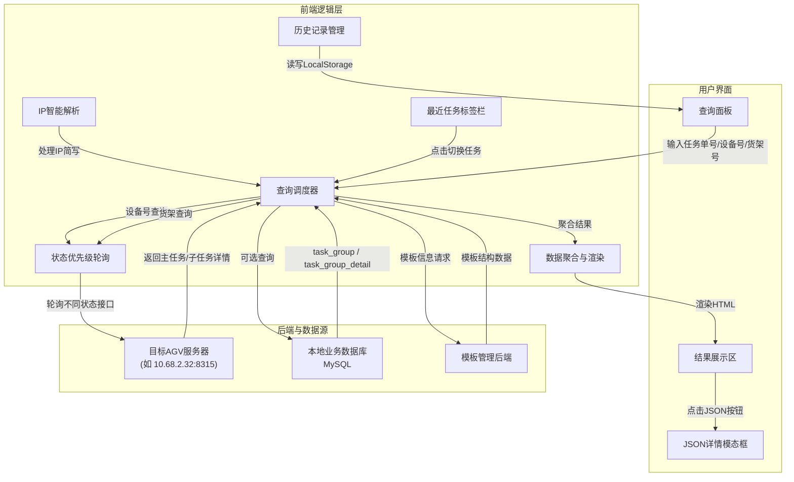
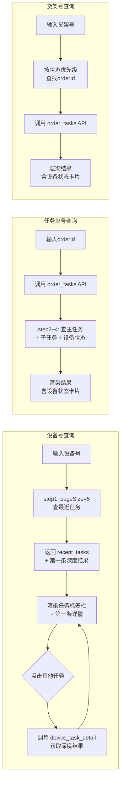
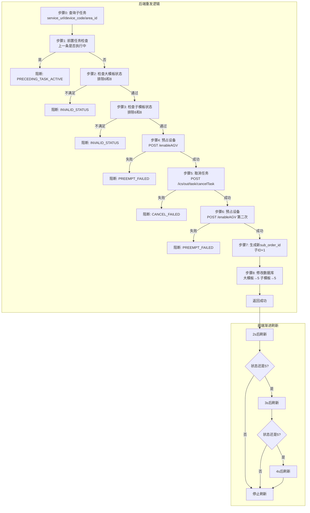

# 跨环境任务分析查询页面

## 📌 概述

本页面是 **AGV 跨环境任务下发系统** 的独立深度查询模块，旨在提供一个统一、强大的任务分析入口。它支持通过**任务单号**、**设备号**或**货架号**进行多维度查询，并能自动聚合跨服务器、跨数据库的任务数据，以清晰的结构化视图呈现，帮助运维与开发人员快速定位问题、分析任务链路。

## 🎯 核心功能

| 功能模块               | 描述                                                                                                                                 |
| :--------------------- | :----------------------------------------------------------------------------------------------------------------------------------- |
| **三模式查询**         | 支持 `任务单号 (OrderId)` 精确查询、`设备号` 深度查询（含最近5条任务切换）、`货架号` 智能查询（按状态优先级自动定位最近任务）。        |
| **设备实时状态**       | 三种查询方式均自动展示设备实时状态卡片（各服务器上的设备状态、电量、区域等）。                                                        |
| **IP 智能输入**        | 支持输入完整 IP（如 `10.68.2.32`）或仅最后一段数字（如 `32`），系统自动补全为 `10.68.2.32`。                                           |
| **本地数据库关联**     | 可选从本地数据库查询 `task_group` 及 `task_group_detail` 表的完整记录，并与远程任务数据并排展示。                                     |
| **模板关联与跳转**     | 自动解析任务关联的大任务模板及子任务模板，并提供 **一键跳转到模板编辑页面** 的快捷入口。                                              |
| **跨服务器子任务聚合** | 根据主任务详情，并发请求各子任务所在的服务器，将分散的子任务状态汇总为统一表格（Markdown 风格渲染）。                                 |
| **同模板任务监控**     | 列出该大模板下**其他执行中/异常状态**的任务清单，便于评估整体负载与冲突。                                                              |
| **原始报文查看**       | 所有接口返回的数据均可通过「查看原始 JSON」按钮在模态框中格式化展示，支持一键复制，便于调试与问题上报。                                 |
| **查询历史记录**       | 自动保存最近 5 次查询关键词（基于 LocalStorage），点击标签可快速回填并重新查询。                                                        |
| **任务重发**           | 支持对非执行中/已完成的任务进行重发，流程含设备预占→取消任务→修改数据库，前端渐进刷新 2s→3s→4s。                                      |

## 🏗️ 系统架构图

## 🔄 查询流程

## 🔄 任务重发流程

## 📁 相关文件

| 文件 | 说明 |
|------|------|
| `templates/query/unified_home.html` | 前端页面（JS逻辑 + HTML模板） |
| `routes/task_routes.py` | 后端 API 路由（设备查询、任务查询、重发等） |
| `modules/query/task_query_extended.py` | 查询核心逻辑（重发、设备状态、数据补充等） |
| `skill/skill_query_page.md` | 开发维护指导 |
